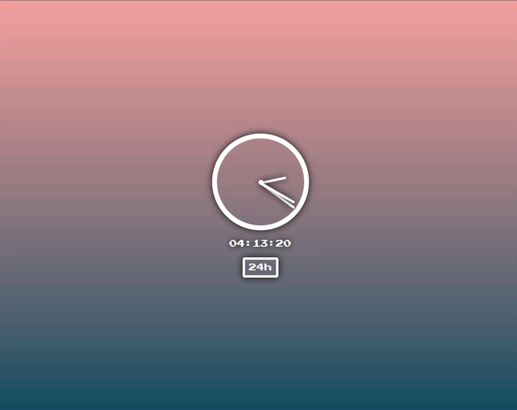

<h1>JavaScript Clock</h1>

Este proyecto pertenece a uno de los proyectos de <a href="https://javascript30.com/"> JavaScript 30</a> donde pone en práctica manipulación del CSS desde Javascript, que en este caso específico se modifica la propiedad transform, para recrear el movimiento de las agujas del reloj. Aquí les dejo la documentación sobre todo lo relacionado con esta propiedad<a href="https://www.w3schools.com/jsref/prop_style_transform.asp"> Style transform Property</a>

<h1>Preview del proyecto<h1>

<h1>Funciones principales</h1>
  <ul>
    <li>Mostrar la hora en versión digital y análoga</li>
    <li>Debe cambiar el formato de hora (24h o 12h) mediante un botón</li>
    <li>Se debe mostrar PM o AM según el horario</li>
    <li>Se debe agregar un "0" adelante de las horas y los minutos si estos son menores a "10"</li>
  </ul>
  
  <h1>Recursos utilizados</h1>
  <ul>
    <li><a href="https://www.w3schools.com/jsref/prop_style_transform.asp"> Style transform Property</a>
</li>
    
Para la documentación de como utilizar el Style transform Property desde el archivo de Js.

    <li><a href="https://www.w3schools.com/jsref/jsref_obj_date.asp"> JavaScript Date Reference</a>
</li>
    
Para la documentación de como obtener las horas, minutos y segundos

    <li><a href="https://www.w3schools.com/c/c_conditions_short_hand.php"> C Short Hand If Else (Ternary Operator)</a>
</li>
    
Para la documentación de como utilizar Ternary Operator, muy útil para hacer rederizado condicinal 

    <li><a href="https://javascript30.com/">JavaScript 30</a></li>
    
Página Web donde podrás conseguir 30 proyectos para practicar tus conocimientos de Js. Muy recomendado!

  </ul>
  <h1>Código</h1>
  
Con toda libertad puedes bajar o clonar este repositorio!

  
Si tienes algún comentario o tienes una mejor forma de desarrollar el código, no dudes en comentarlo! Sharing Is Caring!

